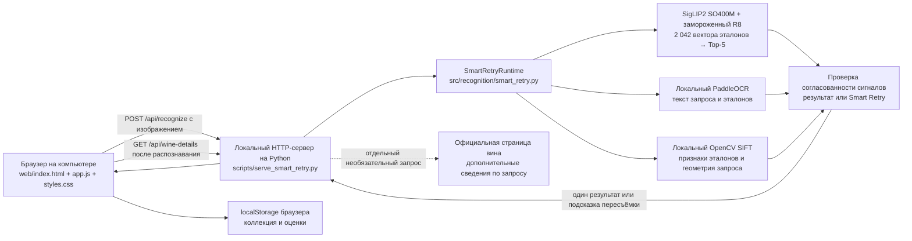

# Архитектура My Wine

Здесь описаны локальная версия Smart Retry и замороженный конвейер
распознавания. Отчёты об экспериментах находятся в `reports/`; они не
используются при обработке пользовательского запроса.

## Состав приложения

Сервер небольшой: `ThreadingHTTPServer` из Python раздаёт настольный
веб-интерфейс, проверяет запросы и вызывает модуль распознавания в том же
процессе. В проекте нет базы данных, аккаунтов пользователей, фоновой очереди
и обращения к внешним моделям распознавания.

## Обработка запроса

1. Браузер принимает локальный файл и автоматически отправляет его как набор
   байтов в `POST /api/recognize`. Загруженное фото не сохраняется в
   репозитории.
2. Обработчик проверяет тип содержимого и ограничивает запрос размером 20 МиБ.
   При декодировании ограничиваются разрешение (40 мегапикселей), минимальная
   длина большей стороны (640 пикселей) и максимальная длина стороны
   (4 096 пикселей). Для нечитаемого, слишком маленького или сильно размытого
   изображения модуль распознавания сразу возвращает `retry`.
3. PaddleOCR обрабатывает уменьшенную копию изображения, у которой большая
   сторона не превышает 1 600 пикселей. Энкодер и SIFT работают с декодированным
   изображением. OCR не формирует список кандидатов каталога.
4. SigLIP2 SO400M кодирует запрос. Сходство с замороженной матрицей векторов
   эталонов вычисляется скалярным произведением нормализованных векторов; так
   формируется детерминированная пятёрка лучших кандидатов (Top-5).
5. Выбранное смешивание визуальных и эталонных OCR-признаков меняет порядок
   пяти кандидатов. Затем SIFT оценивает геометрическое соответствие этой же
   пятёрки; его оценка объединяется с оценками после OCR с фиксированным весом
   `0.40`. Эти этапы не добавляют новых slug.
6. Модуль распознавания сопоставляет итогового победителя с визуальным, OCR- и
   геометрическим сигналами. Карточка `found` возвращается, когда за одного
   победителя голосуют как минимум два из трёх сигналов. Иначе возвращается
   причина для `retry` и предполагаемый slug для диагностики. Интерфейс
   показывает подсказку пересъёмки, но не предлагает выбрать вино из Top-5.
7. После распознавания браузер может запросить сведения с публичной страницы
   вина через `GET /api/wine-details`. Запрос выполняется после поиска и не
   входит в критичный по времени путь распознавания.

Проверка согласованности — набор фиксированных правил, а не откалиброванная
вероятность. OCR-сигнал использует минимальный отрыв эталонного текста `0.05`;
SIFT-сигнал требует валидной геометрии и нормализованного отрыва не менее
`0.15`. Порог согласованности и эвристики качества снимка не калибровались на
выборке реальных фотографий с ручной проверкой.

## Замороженные модели и локальные файлы

Модуль распознавания использует выбранную модель R8 пятой эпохи и связанные с
ней кэши:

- Базовый визуальный энкодер: `google/siglip2-so400m-patch14-384`, ревизия
  `e8e487298228002f3d8a82e0cd5c8ea9c567f57f`. Модель загружается только из
  локального кэша Hugging Face.
- LoRA: проверенный чекпоинт с рангом 8
  `artifacts/experiments/so400m_hard_negative_lora_20260923T203613Z/checkpoints/epoch_005.pt`.
- Адаптированные эталонные векторы и метаданные:
  `artifacts/experiments/frozen_baseline_forensics_20260924T044708Z/lora_evaluation/adapted_reference_cache/`.
- Порядок slug каталога: `artifacts/reference_embeddings/siglip2_so400m_384/slugs.json`.
- Эталонный OCR-кэш:
  `artifacts/experiments/so400m_ocr_reranker_20260920T193925Z/ocr/reference_ocr.jsonl`.
- Параметры SIFT и каталог признаков: конфигурация в
  `artifacts/experiments/final_ml_geometric_reranker_20260923T082259Z/` и
  указанный в ней путь к кэшу.
- Эталонные фотографии каталога: 2 042 файла в
  `data/processed/reference_images/`.

Модель, LoRA-веса, фотографии каталога и кэши — отдельные входные данные. При
запуске модуль распознавания проверяет SHA-256 чекпоинта, соответствие slug
каталога и кэшей, контрольные суммы всех эталонных изображений, размерность и
нормализацию векторов, покрытие OCR, версию OpenCV, конфигурацию и отпечаток
кэша SIFT. Перед открытием HTTP-порта версия на GPU прогревается на трёх
эталонных изображениях. Скрипт `scripts/check_demo_assets.py` заранее проверяет
наличие файлов и основные связи между кэшами; окончательной проверкой остаётся
полный запуск сервера.

Для воспроизведения показа нужны файлы, не хранящиеся в Git. Их точный перечень,
передача зафиксированной версии модели Hugging Face и подготовка моделей
PaddleOCR описаны в `web/README.md`. Нельзя отдельно заменять один из
артефактов: чекпоинт, эталонные изображения и кэши связаны проверками
контрольных сумм и отпечатков.

## API и границы интерфейса

| Маршрут | Входные данные | Ответ или назначение |
|---|---|---|
| `GET /api/health` | Нет | `ready` или `busy`, длительность текущего и последнего запроса |
| `POST /api/recognize` | Байты JPEG, PNG, WebP или `application/octet-stream` | Ответ для интерфейса: `found` с одной карточкой или `retry` с причиной |
| `POST /v1/eval/predict` | `multipart/form-data`, ровно одно поле `image` с файлом изображения | Контракт `participant_test.sh`: HTTP 200 и плоский JSON `{"slug":"..."}` |
| `POST /api/predict` | Байты изображения поддерживаемого типа | Совместимый raw-body маршрут: плоский JSON `{"slug":"..."}` |
| `GET /api/wine-details?slug=...` | Slug из каталога | Дополнительные сведения с соответствующей публичной страницы вина |
| `GET /web/` | Нет | Статический настольный веб-интерфейс |

Распознавание выполняется последовательно. Проверочный `participant_test.sh`
отправляет один запрос и ждёт полного ответа перед следующим; поэтому обычный
прогон не создаёт параллельных запросов. Параллельный запрос получает HTTP 503
и заголовок `Retry-After: 1`; браузер повторяет запрос после ответа о занятости.
По умолчанию сервер привязан к `127.0.0.1`. Статические файлы
разрешено раздавать только из `/web/`, манифеста каталога и папки эталонных
изображений. У сервиса нет аутентификации, он предназначен для локального
показа; не открывайте его в недоверенную сеть.

Функции в браузере отделены от распознавания:

- **Match for You** оценивает распознанное вино по пользовательским оценкам
  типа вина, сорта и региона. Для каждой характеристики используется
  небольшой нейтральный априорный рейтинг. Нужны оценки как минимум пяти вин;
  это простая эвристика, а не обученная модель рекомендаций. Если текущее
  вино уже оценено, интерфейс показывает личную оценку пользователя.
- **Сравнение вин** хранит две распознанные позиции в памяти страницы и
  показывает их характеристики из каталога и официального сайта, если они
  доступны.
- **Моя коллекция** хранит вина «Хочу попробовать» и уже опробованные вина с
  оценками в `localStorage` этого браузера. Данные не синхронизируются с
  сервером или другими устройствами.

Если официальный сайт недоступен, это не меняет результат распознавания. Для
известных полей интерфейс использует данные каталога как запасной вариант;
неизвестные характеристики остаются пустыми. Коллекция пользователя хранится
только в браузере.

## Оценка качества и ограничения выводов

Во внутреннем замере использовались 100 эталонных фотографий каталога,
последовательно, после прогрева на локальной RTX 4060: `p50 — 304 мс`,
`p95 — 1 117 мс`, `p99 — 1 237 мс`, максимум — `1 484 мс`. Все 100 запросов
заняли меньше трёх секунд. На этой выборке 97 ответов были точными `found`,
3 завершились `retry`, неверных `found` не было. Этот результат не доказывает
точность на реальных пользовательских фото, пропускную способность при
параллельных запросах или SLA на любом оборудовании.

Новый набор из 100 полевых фото ещё не размечен вручную по точному slug или
отсутствию совпадения. Синтетические наборы (`synthetic_dev`), подборки вин из
похожих семейств (`hard_near_duplicate_dev_v2`) и стрессовые изображения
(`generated_stress_dev_pilot32`) служат для диагностического сравнения методов
и не являются закрытым тестом организаторов. В презентации эти результаты
нужно разделять.

## Где находится код

- `scripts/serve_smart_retry.py` — локальный HTTP-сервер и обработка маршрутов.
- `src/recognition/smart_retry.py` — проверка файлов при запуске, ранжирование
  и правило согласованности сигналов.
- `src/recognition/so400m_lora.py`, `text_signals.py`,
  `geometric_reranker.py` — адаптер модели, OCR-сигналы и геометрический
  пересчёт.
- `src/recognition/official_wine_details.py` — получение сведений с публичной
  страницы после распознавания.
- `web/` — интерфейс, Match for You, сравнение вин, коллекция и стили.
- `scripts/check_demo_assets.py` — предварительная проверка локальных файлов.
- `reports/` — датированные отчёты об экспериментах, интерфейсе и скорости.
